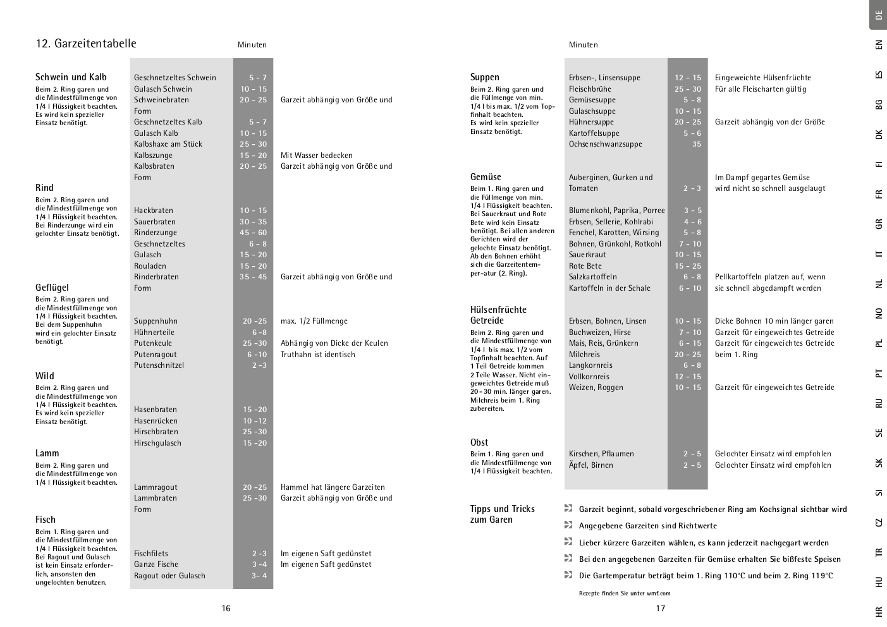

# Cooking Techniques

## Preservation

### Sterilisation in a Pressure Cooker

Gläser mit 1l Inhalt werden im 6,5 l und 8,5 l Schnelltopf, kleinere Gläser im 4,5 l Schnelltopf eingekocht. Vorbereiten der Lebensmittel wie üblich. 1/4 l Wasser in den Topf füllen.
Einweckgläser in den gelochten Einsatz setzen.

* **Gemüse/Fleisch** beim 2. orangefarbenen Kochring ca. 20 min garen
* **Steinobst** beim 1. orangefarbenen Kochring ca. 5 min garen
* **Kernobst** beim 1. orangefarbenen Kochring ca. 10 min garen

Zum Abdampfen Topf langsam abkühlen lassen (Methode 1: ganz Abkühlen lassen) – nicht mit dem Drehknopf (8) oder unter fließendem Wasser drucklos machen, weil sich sonst der Saft aus den Gläsern drückt.

See: [Sicherheitshinweise & Gebrauchsanweisung Schnellkochtopf PerfectUltra PerfectPro](https://www.wmf.com/media/wmf_upload/bedienungsanleitungen/de/64_1068_0790_002_IFU_Perfect_UltraPro.pdf)

## Pressure Cooker

### Preservation

See [Sterilisation in a Pressure Cooker](#sterilisation-in-a-pressure-cooker)

### Cooking Times

